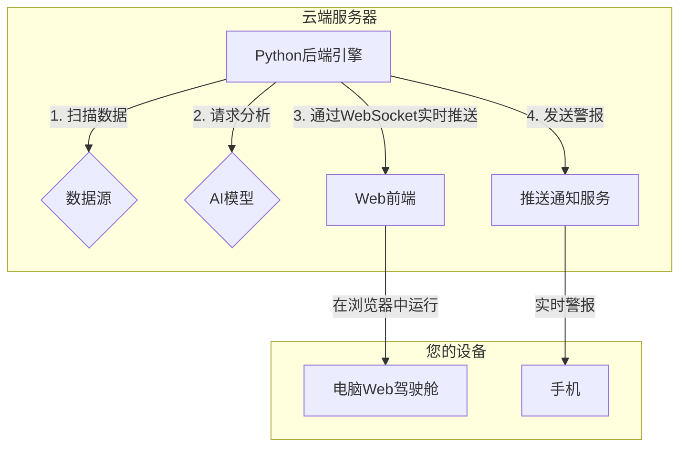

# Alpha狩猎系统开发日志

本文档记录了“Alpha狩猎系统”项目从构思到实施的全过程，包含了核心方案、技术选型和开发步骤。

## V2.0 核心方案：Web核心实施蓝图

### 核心架构：后端驱动的实时Web应用

系统由两大部分组成：
1.  **后端云端引擎**: 7x24小时在云服务器上运行的Python程序，负责数据抓取、市场扫描、AI分析和逻辑判断。
2.  **Web前端驾驶舱**: 在电脑浏览器中运行的应用，通过WebSocket从后端实时接收分析结果和警报。

### 完整执行步骤大纲

#### 第一阶段：后端核心引擎开发 (The Engine Room)
- **目标**: 在本地电脑上用纯Python跑通核心的“机会发现与AI分析”逻辑。
- **产出**: 一个能在命令行终端打印出高质量分析结果的`main.py`脚本。

#### 第二阶段：Web服务化与实时通信层 (The Nerve Center)
- **目标**: 将后端的分析能力，通过Web技术（FastAPI + WebSocket）暴露出来。
- **产出**: 一个可以通过WebSocket实时推送JSON数据流的本地Web服务。

#### 第三阶段：Web前端驾驶舱开发 (The Cockpit)
- **目标**: 开发一个清晰、直观、数据驱动的Web用户界面。
- **技术选型**: Vue.js/React, Tailwind CSS, ECharts。
- **产出**: 一个能与本地后端实时交互的Web应用原型。

#### 第四阶段：高级功能、部署与移动端集成
- **目标**: 将系统部署到云端，并打通手机警报，完成最后的闭环。
- **部署**: 后端部署到Render.com，前端部署到Vercel/Netlify。
- **移动端**: 通过Pushover等服务接收实时推送通知。
- **产出**: 一个部署在云端、可7x24小时自动化运行的系统。

---

### **Alpha狩猎系统 - Web核心实施蓝图 (V2.0)**

#### **核心架构：后端驱动的实时Web应用**

这个架构比之前的更简洁、更强大。


*   **核心变化**: 我们用**WebSocket**技术取代了传统的API请求。这意味着后端一旦发现新数据，会**主动、实时地**将信息推送到您的Web页面，您的页面数据会“自动刷新”，而不需要您手动操作，体验就像一个专业的桌面软件。

---

### **全新执行步骤大纲**

我们将项目重新划分为四个逻辑清晰、循序渐进的阶段。

#### **第一阶段：后端核心引擎开发 (The Engine Room)**

**目标**: 与之前完全相同，在本地电脑上用纯Python跑通核心逻辑。这是所有后续工作的基础，**此阶段的产出是一个能在命令行终端打印出高质量分析结果的`main.py`脚本。**

*   **1.1. 项目初始化**: (同前)
*   **1.2. 数据连接器开发 (`data_provider.py`)**: (同前)
*   **1.3. 机会扫描引擎开发 (`scanner.py`)**: (同前)
*   **1.4. AI分析模块开发 (`ai_analyzer.py`)**: (同前)
*   **1.5. 主程序整合 (`main.py`)**: (同前)

**【第一阶段里程碑】**: 您拥有一个能在本地命令行稳定运行、发现机会并进行AI分析的Python核心程序。

---

#### **第二阶段：Web服务化与实时通信层 (The Nerve Center)**

**目标**: 将后端的分析能力，通过Web技术暴露出来，并建立实时通信管道。

*   **2.1. 后端框架选型**:
    *   [ ] 使用 **FastAPI**。它不仅支持传统的Restful API，还内置了对 **WebSocket** 的一流支持，是这个项目的完美选择。

*   **2.2. 创建WebSocket端点**:
    *   [ ] 在`api_server.py`中，创建一个WebSocket端点 `/ws/dashboard`。
    *   [ ] 将第一阶段的`main.py`改造成一个循环任务。这个任务会定期（例如每分钟）运行一次扫描和分析逻辑。
    *   [ ] 一旦发现新的交易机会或现有机会有状态更新，就通过这个WebSocket连接，将**JSON格式**的数据**主动推送**给所有连接的客户端（即您的Web页面）。

*   **2.3. 创建传统的API端点 (作为辅助)**:
    *   [ ] 创建一个 `GET /history` 端点，用于Web页面首次加载时，获取当天已经发现的所有历史机会。

**【第二阶段里程碑】**: 您可以在本地运行FastAPI服务，并使用一个简单的工具来测试WebSocket连接，能够看到后端实时推送过来的JSON数据流。

---

#### **第三阶段：Web前端驾驶舱开发 (The Cockpit)**

**目标**: 开发一个清晰、直观、数据驱动的Web用户界面。

*   **3.1. 前端技术选型**:
    *   [ ] **框架**: **Vue.js** 或 **React**。两者都是现代Web开发的主流选择。Vue.js通常对新手更友好，学习曲线更平缓。
    *   [ ] **UI组件库**: **Tailwind CSS** (用于快速构建美观的自定义布局) 或 **Element Plus** (基于Vue.js的一套现成的美观组件)。
    *   [ ] **图表库**: **ECharts** 或 **TradingView Lightweight Charts™** (如果需要专业的K线图)。

*   **3.2. 页面布局设计**:
    *   [ ] **主仪表盘 (`Dashboard.vue`)**:
        *   **左侧面板**: “机会列表 (Opportunity List)”，实时显示后端推送过来的最新交易机会。
        *   **右侧主面板**: “机会详情 (Opportunity Detail)”，当点击左侧列表项时，这里会展示该机会的详细AI分析报告、关键数据和图表。
    *   [ ] **历史回顾页面 (`History.vue`)**: 用于查看过去几天的交易机会和分析记录。

*   **3.3. 实时数据绑定**:
    *   [ ] 在前端代码中，建立到后端WebSocket服务器的连接。
    *   [ ] 编写逻辑，监听从WebSocket接收到的新数据，并用这些数据**实时地、动态地**更新机会列表和详情页面的内容，无需用户刷新页面。

**【第三阶段里程碑】**: 您可以在本地同时运行后端服务和前端开发服务器。在浏览器中打开前端页面，您能看到一个完整的Web应用。当您在后端手动触发一个新机会时，Web页面上的列表会**在1秒内自动出现**这个新机会，实现了真正的实时交互。

---

#### **第四阶段：高级功能、部署与移动端集成**

**目标**: 将系统部署到云端，并打通手机警报，完成最后的闭环。

*   **4.1. 部署**:
    *   [ ] **后端部署**: 将您的FastAPI应用部署到 **Render.com** 或 **Heroku** 等云平台。
    *   [ ] **前端部署**: 将您编译好的Vue/React应用部署到静态网站托管服务，如 **Vercel**, **Netlify**, 或 **Cloudflare Pages**。

*   **4.2. 推送通知集成**:
    *   [ ] **后端**: 集成一个推送通知服务，如 **企业微信/钉钉机器人**, **Pushover**, **ntfy** 等。这些服务都提供简单的API，调用一下就能把消息推送到您的手机或工作群。
    *   [ ] **手机端**: 在您的手机上安装对应服务的APP（如企业微信、钉钉）。
    *   [ ] **逻辑**: 在后端代码中，当一个高置信度的机会出现，或者某个价格点位被触发时，调用推送API，发送一条简短的警报信息到您的手机。

*   **4.3. 交易API集成 (高级功能)**:
    *   [ ] 这是一个高级的、可选的未来扩展方向。当条件成熟时，可以在后端引擎中加入与**国内券商（如华泰、中信等）提供的交易API**的连接。
    *   [ ] **功能展望**: 可以从券商API获取更精确的实时行情数据、查询您的真实仓位和购买力，并在“Web驾驶舱”中展示出来。
    *   [ ] **未来愿景**: 甚至可以在Web界面上增加一个“执行”按钮，点击后通过后端API向券商发送交易指令（此功能风险高，需在符合法规和安全要求的前提下，谨慎实现）。

---

### **结论与下一步**

这个全新的、以Web为核心的大纲，路径更清晰，技术栈更现代，最终的产品体验也会更好。

*   **它规避了iOS原生开发的复杂性。**
*   **它让您的主操作平台（电脑Web）功能极其强大。**
*   **它通过推送通知，依然保留了移动端的实时性。**

---

我们在Cursor中需要进行的设置，主要围绕三个目标：**代码一致性、AI协作效率、以及项目管理**。

---

### **第一步：项目专属的工作区设置 (Workspace Settings)**

为了不污染您的全局设置，我们将为“Alpha狩猎系统”这个项目创建一套专属的配置。

1.  **打开项目文件夹**:
    *   在Cursor中，通过 `File` > `Open Folder...` 打开您为这个项目创建的文件夹。

2.  **创建工作区配置文件**:
    *   在项目根目录下，创建一个名为 `.vscode` 的文件夹。
    *   在 `.vscode` 文件夹内，创建一个名为 `settings.json` 的文件。
    *   这个文件里的所有设置将**仅对本项目生效**。

3.  **配置代码格式化与检查 (Code Formatting & Linting)**:
    *   这是为了保证我们编写的Python代码风格统一，易于阅读和维护。
    *   **在 `settings.json` 中添加以下内容**:
        ```json
        {
          // --- Python语言专属设置 ---
          "[python]": {
            // 设置默认的代码格式化工具为 black
            "editor.defaultFormatter": "ms-python.black-formatter",
            // 在保存文件时自动进行格式化
            "editor.formatOnSave": true
          },
          // --- Black Formatter 的具体设置 ---
          "black-formatter.args": [
            // 设置每行最大字符数为100，便于阅读
            "--line-length=100" 
          ],
          // --- Python Linter 的设置 ---
          "python.linting.enabled": true,
          "python.linting.pylintEnabled": true // 或者使用 flake8
        }
        ```
    *   **需要安装的扩展**: Cursor会提示您安装 `Python`, `Black Formatter`, `Pylint` 等扩展，请全部同意安装。

---

### **第二步：优化AI协作 - 定制规则 (Rules)**

这是发挥Cursor最大威力的关键。我们要为AI设定清晰的“行为准则”，让它成为一个符合我们项目规范的“代码助手”。

1.  **打开“Rules & Memories”**:
    *   点击Cursor左侧边栏的相应图标，或者使用快捷键。

2.  **创建项目专属规则 (Create Rule)**:
    *   **规则名称**: `AlphaHunter Project Guidelines`
    *   **规则内容 (Prompt)**: 请将以下内容复制并粘贴到规则中。这是一个精心设计的Prompt，用于指导AI的行为。

    ```
    你是一名资深的Python量化系统开发工程师，正在协助我开发一个名为“Alpha狩猎系统”的项目。在与我协作时，请严格遵守以下所有准则：

    1.  **技术栈遵从**:
        *   后端核心框架使用 **FastAPI**。
        *   数据处理优先使用 **Pandas**。
        *   所有API请求使用 **requests** 库，并进行适当的异常处理。
        *   异步任务使用Python内置的 **asyncio**。

    2.  **代码风格与质量**:
        *   所有代码必须遵循 **PEP 8** 规范。
        *   优先编写带有**类型提示 (Type Hinting)** 的函数，例如 `def get_data(ticker: str) -> pd.DataFrame:`。
        *   对于核心或复杂的函数，请为其编写清晰的**文档字符串 (Docstrings)**，说明其功能、参数和返回值。
        *   避免使用硬编码（Hard-coding）。所有API密钥、配置参数等都应从配置文件或环境变量中读取。

    3.  **项目结构与逻辑**:
        *   遵循模块化设计，将不同功能的代码（如数据获取、AI分析、API服务）分离到不同的文件中。
        *   当进行AI分析时，设计的Prompt应清晰、具体，并要求返回**结构化的JSON**，而不是自由文本。

    4.  **交互方式**:
        *   当我要求你“编写一个函数”或“创建一个模块”时，请直接提供完整的、可运行的代码块。
        *   当我要求你“重构”或“优化”现有代码时，请使用Cursor的编辑功能直接修改文件，而不是只给出建议。
    ```
    *   **激活规则**: 确保这条规则是开启状态。

---

### **第三步：项目上下文管理 (Context Management)**

我们要让AI随时了解项目的全貌。

1.  **使用 `@Codebase`**:
    *   在与AI聊天时，如果问题涉及到整个项目，请在提问前先输入 `@Codebase`。这将让AI在回答前，先对您的整个项目文件进行索引，从而给出更具上下文感知能力的答案。
    *   例如：`@Codebase 我想在项目中增加一个处理期权数据的新模块，应该放在哪里，结构如何设计？`

2.  **管理 `.cursorignore` 文件 (可选)**:
    *   如果您的项目中有一些不希望AI看到的文件（例如，大量的日志文件、测试数据、虚拟环境文件夹），可以在项目根目录下创建一个 `.cursorignore` 文件。
    *   **建议内容**:
        ```
        # 忽略Python虚拟环境
        venv/
        __pycache__/

        # 忽略测试数据和日志
        *.log
        test_data/
```